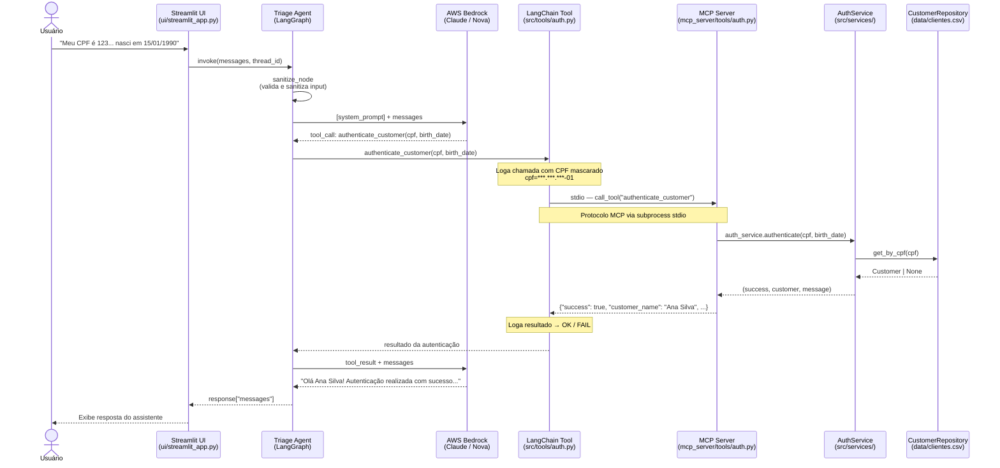
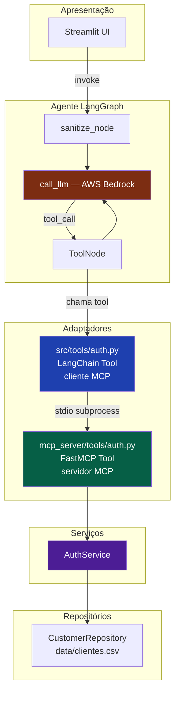
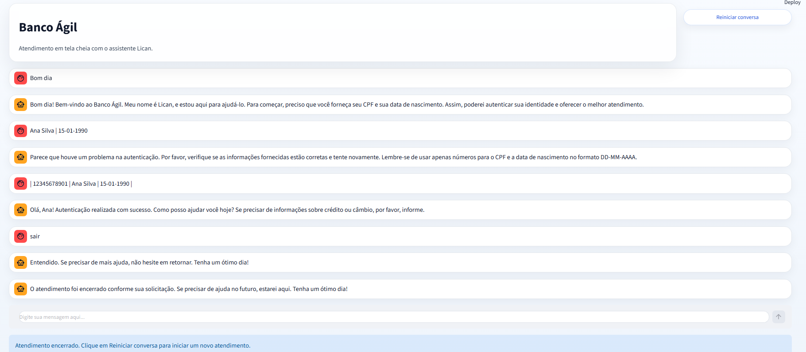
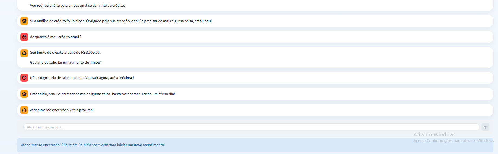
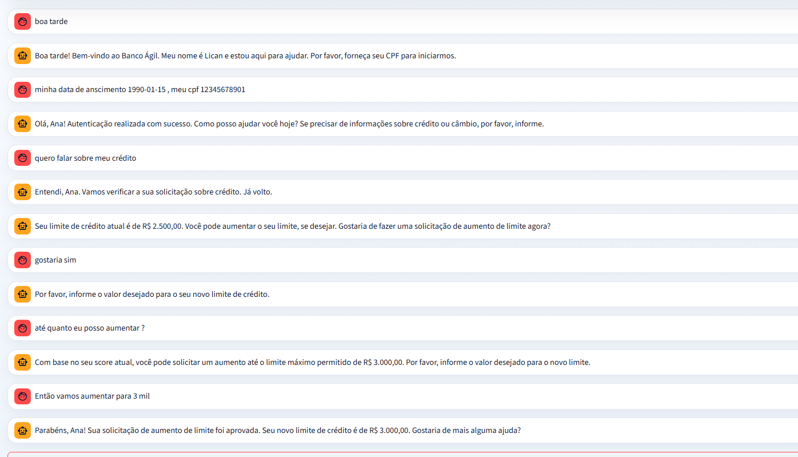
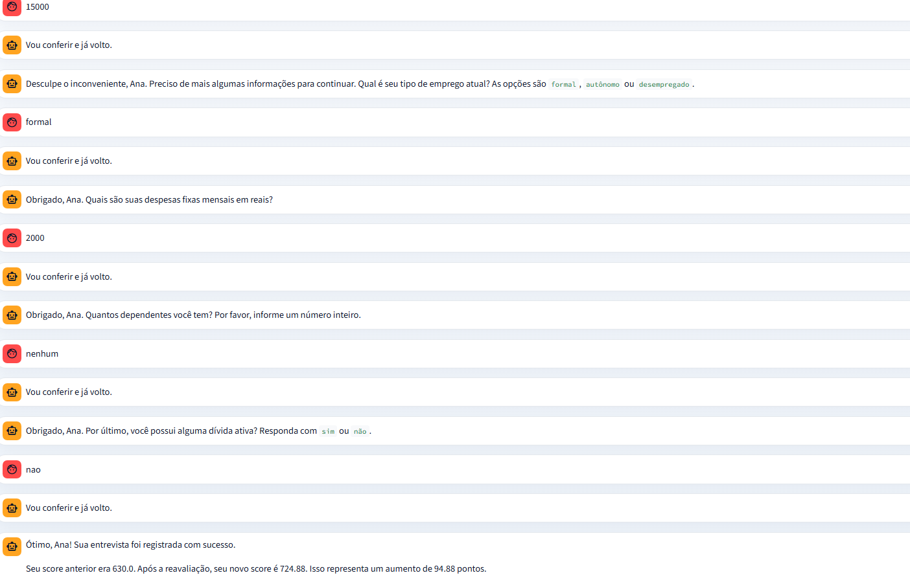
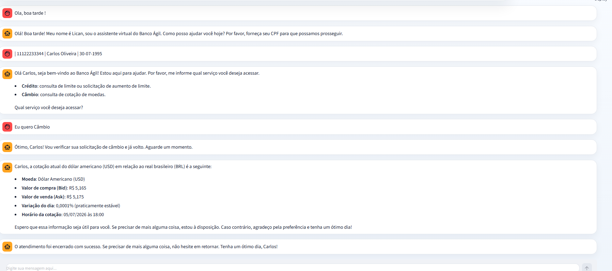

# Banco Ágil IA

## Índice
- [Visão Geral do Projeto](#visão-geral-do-projeto)
- [Stack](#stack)
  - [Tecnologias Principais](#tecnologias-principais)
  - [Escolha da Stack](#escolha-da-stack)
  - [Dependências e Versões](#dependências-e-versões)
- [Arquitetura do Sistema](#arquitetura-do-sistema)
  - [Fluxo base da arquitetura](#fluxo-base-da-arquitetura)
  - [Pré-requisitos](#pré-requisitos)
  - [Configuração](#configuração)
  - [Executar a interface](#executar-a-interface)
  - [Dados de teste](#dados-de-teste)
  - [Exemplo de fluxo](#exemplo-de-fluxo)
- [Camadas da arquitetura](#camadas-da-arquitetura)
- [Funcionalidades implementadas](#funcionalidades-implementadas)
  - [Estrutura do diretório](#estrutura-do-diretório)
  - [Responsabilidade por camada e arquivo](#responsabilidade-por-camada-e-arquivo)
- [Testes](#testes)
- [CI/CD](#cicd)
- [Desafios enfrentados e como foram resolvidos](#desafios-enfrentados-e-como-foram-resolvidos)
- [Demonstração do Projeto](#demonstração-do-projeto)

### Visão Geral do Projeto
O Banco Ágil IA é um sistema inteligente de atendimento ao cliente bancário desenvolvido com agentes de inteligência artificial autônomos. Ele gerencia fluxos integrados de triagem de clientes, consulta e aumento de limite de crédito, realização de entrevista financeira para atualização do score de crédito e cotação de moedas estrangeiras (câmbio) em tempo real.

## Stack

### Tecnologias Principais

| Camada | Tecnologia |
| --- | --- |
| Linguagem | Python 3.12.3 |
| LLM / Infraestrutura | Amazon Bedrock e Docker |
| Modelo de embeddings utilizado | Titan Embeddings v2 |
| Modelo de raciocínio utilizado | AWS Nova Pro |

#### Escolha da Stack

A stack foi escolhida com base nos seguintes critérios:

* **Python**: Além de ser a linguagem exigida no desafio, possui um ecossistema consolidado para análise de dados com Pandas (facilitando a manipulação e persistência em arquivos CSV) e suporte nativo às bibliotecas do LangChain e LangGraph.
* **AWS Bedrock**: Permite utilizar chaves de acesso do IAM já configuradas no ambiente, acelerando o desenvolvimento e evitando perda de tempo com a configuração inicial de novos provedores de nuvem.
* **AWS Nova Pro**: Oferece uma excelente relação custo-benefício em comparação com outros modelos proprietários do mercado. Ele apresenta ótimos resultados na compreensão e estruturação de tarefas textuais complexas, desde que o fluxo da informação seja bem direcionado pelos nós do grafo.

*(Nota: O projeto suporta a utilização de qualquer outro modelo compatível com o LangChain, bastando alterar as variáveis correspondentes no arquivo `.env`.)*

### Dependências e Versões

As principais bibliotecas e frameworks de apoio do projeto são controlados e pinados nas seguintes versões:

| Biblioteca | Versão | Descrição |
| --- | --- | --- |
| **mcp** | `1.28.1` | Protocolo para comunicação externa de recursos e ferramentas |
| **langchain** | `1.3.11` | Framework principal de orquestração do LLM |
| **langgraph** | `1.2.7` | Orquestração de grafos de estados e fluxos de conversa (handovers) |
| **boto3** | `1.43.40` | SDK oficial da AWS para conexão e comunicação com o Bedrock |
| **pydantic** | `2.13.4` | Validação de dados de entrada e conversão de schemas de dados |
| **pydantic-settings** | `2.14.2` | Carregamento automático e validação de configurações via variáveis de ambiente |
| **streamlit** | `1.58.0` | Interface web interativa simples para simulação de atendimentos |
| **pandas** | `3.0.3` | Manipulação e leitura estruturada de arquivos CSV (banco de dados) |
| **pytest** | `9.1.1` | Framework de testes unitários e de integração |
| **python-dotenv** | `1.2.2` | Carregamento de variáveis de ambiente do arquivo `.env` |


## Arquitetura do Sistema

### Fluxo base da arquitetura

```
Usuário
  -> Agent de Triagem
        -> Tool de Autenticação
              -> Service de Validação
                    -> CustomerRepository (CSV)
        -> Tool de Crédito
              -> Service de Crédito/Score
                    -> CustomerRepository / ScoreLimitRepository (CSV)
```

O sistema vai seguir a estrutura MCP para a comunicação dos agentes de IA com as operações a serem realizadas e gravadas nos arquivos CSV. Esse padrão vai ser seguido para desacoplar a lógica dos agentes de IA com as operações de fontes de dados, fazendo com que haja um fluxo mais previsível de repasse da informação entre o services para o agente, facilitando a manutenção e o rastreamento dos logs.

Dentro do diretório `src`, a estrutura de pastas é organizada da seguinte forma:

```
src/
├── agents/
│   ├── triage.py
│   ├── credit.py
│   ├── interview.py
│   └── exchange.py
├── tools/
│   ├── auth.py
│   ├── credit.py
│   ├── interview.py
│   └── cambio.py
├── services/
│   ├── routing.py
│   └── score.py
├── repositories/
│   ├── __init__.py
│   ├── credit_request_repository.py
│   ├── customer_repository.py
│   └── score_limit_repository.py
├── models/
│   └── schemas.py
└── config/
      └── settings.py
```

* **agents**: Contém a lógica de comportamento e fluxo de conversa de cada agente (triagem, crédito, entrevista e câmbio). O agente de triagem atua como porta de entrada e, após a autenticação, classifica as intenções do usuário de forma inteligente.
* **tools**: Concentra as ferramentas que os agentes de IA podem acionar (integrações externas, leituras e escritas nos bancos de dados CSV, etc.), assegurando um fluxo previsível e reduzindo chances de alucinações.

config: guardará as configurações centrais do projeto, como caminhos dos arquivos CSV, constantes de domínio, parâmetros de execução e eventuais chaves ou variáveis de ambiente necessárias para o funcionamento da aplicação. A ideia é centralizar tudo que for configuração para evitar valores espalhados pelo código e facilitar ajustes futuros.

models: vai funcionar como a camada de contratos da aplicação, definindo os dados e o tipo de cada informação a ser inserida, separada por domínio (score, cliente, etc).

repositories: estabelece a conexão com a persistência de dados em arquivos CSV de forma desacoplada por domínio e facilitando uma migração futura para bancos de dados como MySQL, SQLite, PostgreSQL etc.

services: aqui vai ficar a regra de negócio, os cálculos, as validações e também as operações mais gerais, separadas por domínio.

tests: camada de testes, aqui irei colocar somente alguns básicos para validar as integrações entre os serviços e para validar se as tratativas contra prompt injection estão bem definidas. Vou tratar uma cobertura de 80% dos cenários principais como resultado positivo, por se tratar somente de um teste.

### Pré-requisitos

- Python 3.12+
- Credenciais AWS com acesso ao Amazon Bedrock

### Configuração

```bash
# Clone e entre no diretório do projeto
cd banco_agil

# Crie e ative o ambiente virtual
python -m venv .venv
.venv\Scripts\activate        # Windows
# source .venv/bin/activate   # Linux/macOS

# Instale as dependências
pip install -r requirements.txt

# Configure as variáveis de ambiente
cp .env.example .env
# Edite .env com suas credenciais AWS e modelo Bedrock
```

### Executar a interface

```bash
streamlit run ui/streamlit_app.py
```

### Dados de teste

| CPF | Nome | Nascimento | Score | Limite |
| --- | --- | --- | --- | --- |
| 12345678901 | Ana Silva | 15-01-1990 | 630 | R$ 2.500 |
| 98765432100 | Bruno Santos | 20-11-1985 | 250 | R$ 500 |
| 11122233344 | Carlos Oliveira | 30-07-1995 | 850 | R$ 5.000 |

### Exemplo de fluxo




---

## Camadas da arquitetura




---

## Funcionalidades implementadas

### Estrutura do diretório

```text
banco_agil/
├── data/
│   ├── clientes.csv
│   ├── score_limite.csv
│   ├── solicitacoes_aumento_limite.csv
│   └── logs/
├── mcp_server/
│   ├── server.py
│   └── tools/
├── src/
│   ├── agents/
│   │   ├── state.py
│   │   ├── supervisor.py
│   │   ├── triage.py
│   │   ├── credit.py
│   │   ├── interview.py
│   │   └── exchange.py
│   ├── tools/
│   │   ├── auth.py
│   │   ├── credit.py
│   │   ├── interview.py
│   │   ├── exchange.py
│   │   ├── routing.py
│   │   └── session.py
│   ├── services/
│   │   ├── auth_service.py
│   │   ├── credit_service.py
│   │   ├── interview_service.py
│   │   ├── exchange_service.py
│   │   ├── routing.py
│   │   └── session_service.py
│   ├── repositories/
│   │   ├── customer_repository.py
│   │   ├── credit_request_repository.py
│   │   └── score_limit_repository.py
│   ├── models/
│   │   ├── customer.py
│   │   ├── credit_request.py
│   │   ├── credit_interview.py
│   │   ├── credit_score.py
│   │   ├── exchange_quote.py
│   │   └── schemas.py
│   ├── config/
│   │   └── settings.py
│   └── utils/
│       ├── logging_middleware.py
│       ├── prompt_loader.py
│       └── sanitizer.py
├── tests/
│   ├── conftest.py
│   ├── test_auth_service.py
│   ├── test_credit_service.py
│   ├── test_credit_state.py
│   ├── test_interview_service.py
│   ├── test_interview_state.py
│   ├── test_exchange_service.py
│   ├── test_exchange_state.py
│   ├── test_graph_integration.py
│   ├── test_routing_service.py
│   ├── test_sanitizer.py
│   ├── test_session_service.py
│   └── test_triage_state.py
└── ui/
    └── streamlit_app.py
```

### Responsabilidade por camada e arquivo

| Camada / arquivo | Função | Exemplo de funcionamento |
| --- | --- | --- |
| `data/clientes.csv` | Base de clientes com CPF, nome, nascimento, score e limite. | Fluxo de autenticação e consulta de dados do cliente. |
| `data/score_limite.csv` | Tabela de apoio para validar aumento de limite conforme score. | Fluxo de análise de aumento de crédito. |
| `data/solicitacoes_aumento_limite.csv` | Registro formal das solicitações de aumento de crédito. | Fluxo de solicitação de aumento com status. |
| `data/logs/` | Pasta para logs do fluxo de atendimento. | Registro do passo a passo da conversa. |
| `mcp_server/server.py` | Ponto de entrada do servidor MCP. | Disponibilização das tools para os agentes. |
| `mcp_server/tools/` | Tools que expõem as operações de negócio via MCP. | Chamada de autenticação, crédito, entrevista e câmbio. |
| `src/agents/state.py` | Estado compartilhado dos agentes e parser de payloads. | Controle do turno atual e dos dados do cliente. |
| `src/agents/supervisor.py` | Roteamento implícito entre os agentes. | Troca silenciosa entre triagem, crédito, entrevista e câmbio. |
| `src/agents/triage.py` | Triagem, autenticação e classificação de intenção. | Fluxo mostrado na imagem de autenticação e transição. |
| `src/agents/credit.py` | Consulta de limite, aumento de limite e redirecionamento. | Fluxo mostrado na imagem de autenticação e aumento de crédito. |
| `src/agents/interview.py` | Entrevista financeira e atualização do score. | Coleta de dados e retorno para nova análise de crédito. |
| `src/agents/exchange.py` | Consulta de cotação e encerramento do atendimento de câmbio. | Fluxo de consulta de moeda e encerramento amigável. |
| `src/tools/auth.py` | Tool LangChain para autenticação do cliente. | Chamada da validação de CPF e data de nascimento. |
| `src/tools/credit.py` | Tools de consulta de limite, aumento e retorno à entrevista. | Consulta de limite, solicitação de aumento e redirecionamento. |
| `src/tools/interview.py` | Tools de registro de entrevista e retorno ao crédito. | Registro de entrevista e volta para nova análise. |
| `src/tools/exchange.py` | Tool de consulta de cotação de moedas. | Busca da cotação do dólar ou outra moeda. |
| `src/tools/routing.py` | Tool de classificação de intenção. | Identificação do assunto informado pelo cliente. |
| `src/tools/session.py` | Tool de encerramento da conversa. | Finalização do atendimento quando o cliente pede. |
| `src/services/auth_service.py` | Regra de autenticação contra `clientes.csv`. | Confirmação dos dados do cliente. |
| `src/services/credit_service.py` | Regra de negócio para consulta e aumento de limite. | Verificação do limite atual e da aprovação do pedido. |
| `src/services/interview_service.py` | Cálculo e persistência do novo score. | Recalcular score após entrevista financeira. |
| `src/services/exchange_service.py` | Consulta de cotação em API externa. | Obter preço atual de moedas em tempo real. |
| `src/services/routing.py` | Classificação determinística de intenção. | Direcionamento para crédito ou câmbio. |
| `src/services/session_service.py` | Encerramento controlado do atendimento. | Fechamento do loop de atendimento. |
| `src/repositories/customer_repository.py` | Leitura e atualização da base de clientes. | Busca e atualização de dados do cliente. |
| `src/repositories/credit_request_repository.py` | Persistência dos pedidos de aumento. | Gravação do histórico de solicitações. |
| `src/repositories/score_limit_repository.py` | Consulta da tabela score x limite. | Retorno do limite máximo permitido. |
| `src/models/*.py` | Contratos de dados do domínio. | Estrutura dos dados usados pelos serviços e tools. |
| `src/config/settings.py` | Configurações e variáveis de ambiente. | Leitura das credenciais e parâmetros da aplicação. |
| `src/utils/logging_middleware.py` | Logging e mascaramento de dados sensíveis. | Proteção de CPF e data nos logs. |
| `src/utils/prompt_loader.py` | Carregamento dos prompts externos. | Leitura dos arquivos de prompt dos agentes. |
| `src/utils/sanitizer.py` | Sanitização de entradas do usuário. | Bloqueio de mensagens fora do padrão esperado. |
| `tests/` | Cobertura unitária e de integração. | Validação dos fluxos principais do projeto. |
| `ui/streamlit_app.py` | Interface Streamlit do atendimento. | Tela de chat para simular o atendimento completo. |


O exemplo acima ilustra principalmente os fluxos de autenticação, consulta de limite e solicitação de aumento de crédito.

---

## Testes

```bash
pytest tests/ -v
```

| Arquivo | Cobertura |
| --- | --- |
| `test_auth_service.py` | Autenticação, formatação de CPF/data |
| `test_routing_service.py` | Classificação de intenções |
| `test_session_service.py` | Encerramento de sessão |
| `test_triage_state.py` | Side effects do grafo de triagem |
| `test_credit_service.py` | Consulta, aprovação e rejeição de limite |
| `test_credit_state.py` | Side effects do grafo de crédito |
| `test_interview_service.py` | Cálculo de score e persistência da entrevista |
| `test_interview_state.py` | Side effects do grafo de entrevista |
| `test_exchange_service.py` | Consulta de cotação e normalização de moedas |
| `test_exchange_state.py` | Side effects do grafo de câmbio |
| `test_sanitizer.py` | Proteção contra prompt injection |
| `test_graph_integration.py` | Fluxos E2E com LLM e MCP mockados |

---

## CI/CD

Pipeline GitHub Actions em `.github/workflows/ci.yml` executa `pytest tests/ -v` em Python 3.12. Variáveis AWS dummy são injetadas no CI para permitir import dos agentes sem credenciais reais.

---

## Desafios enfrentados e como foram resolvidos

### Integração com Servidor MCP (Model Context Protocol)

Embora a implementação de um servidor MCP não fosse um requisito mandatório do projeto, a decisão de adotá-lo partiu do desejo de simular um cenário real de produção. Em aplicações reais, múltiplos canais (como WhatsApp, Slack ou sistemas de chatbot) podem precisar acionar as mesmas regras de negócio e consultas de dados. Como o protocolo MCP é recente, acoplá-lo com o cliente LangChain e o fluxo de ferramentas exigiu um estudo aprofundado sobre comunicação via subprocesso `stdio` e a correta declaração de schemas.

### Transição Silenciosa e Estado de Autenticação

Durante o desenvolvimento inicial, ocorreu um problema em que os subagentes (como o de Crédito) exigiam que o cliente passasse por uma nova autenticação ou falhavam ao tentar consultar o contexto. Para solucionar esse comportamento indesejado, a máquina de estados do LangGraph foi projetada para compartilhar dados de sessão persistentes na memória do thread (via `AgentState`). Desse modo, informações como nome, CPF e score atual do cliente fluem de forma segura entre os agentes, permitindo uma transição invisível para o usuário final.

---

## Demonstração do Projeto

Abaixo estão algumas capturas de tela demonstrando o funcionamento da interface Streamlit do **Banco Ágil**:

### 1. Autenticação do Cliente
O fluxo se inicia com o assistente Lican solicitando os dados cadastrais (CPF e Data de Nascimento) para liberação do acesso.


### 2. Consulta de Saldo e Limite de Crédito
Após autenticado, o cliente pode consultar o seu limite atual de forma instantânea.


### 3. Solicitação de Aumento de Crédito
O cliente pode pedir um aumento. Caso aprovado, o novo limite é atualizado no banco de dados.


### 4. Entrevista de Crédito
Se a solicitação for rejeitada pelo score, o cliente é redirecionado à entrevista financeira, que atualizará seu score dinamicamente.


### 5. Cotação de Câmbio
Consulta de moedas estrangeiras integrada em tempo real.

